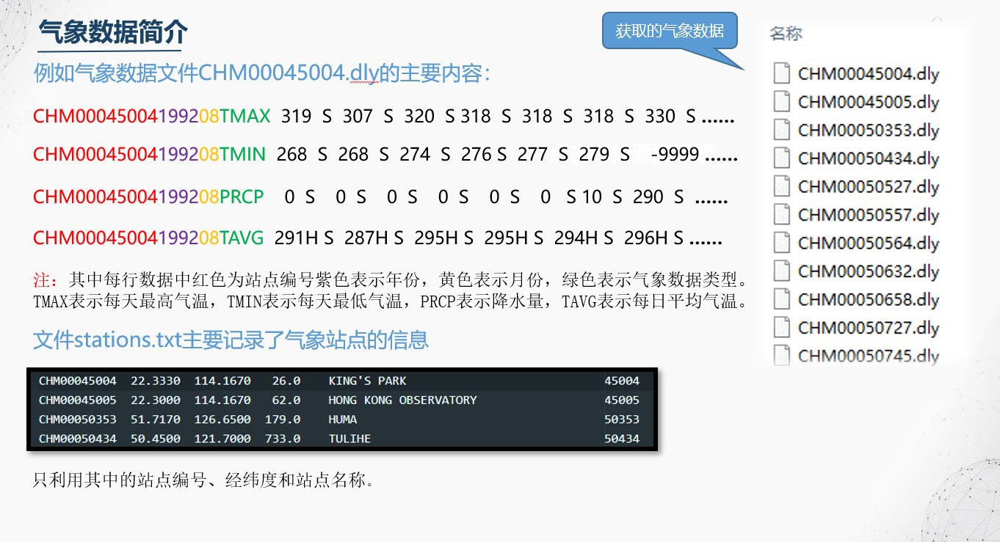
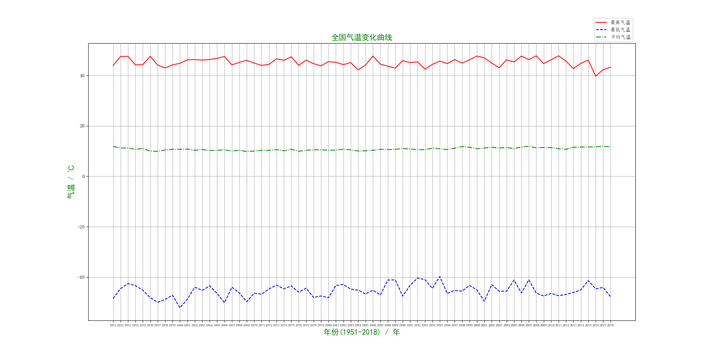

#### 《大数据技术基础》结课作业

## 基于Spark对全国历史气象数据的分析


- **获取气象数据**

    -  从[www.data.gov](http://www.data.gov/)下载气象数据
    -  数据集整合了来自大约30个不同数据源的每日气候观测。包含了全球90，000多个陆基台站的台站测量数据，从中只取出中国站点的数据。
    -  

- **用****PySpark****处理数据**

    - **将所有文件读为一个****RDD**  rdd = sc.wholeTextFiles("file:///" + os.getcwd() + "/china/")
    - **数据清洗 **  去除字母， -9999等无效数据
    - **进行计算、排序等操作**   计算出最大值，最小值，平均值，并按照年份排序。最终得出各个站点以及全国每年的主要气象数据的统计结果。
    - **将结果存入数据库中**   得出的结果和stations.txt文件中站点的主要信息分别存入MySQL数据库中。

- 数据可视化

    主要运用了Python的第三方库matplotlib和pyecharts

    

    .png)

    <h4 align="center">Thanks</h4>
    
``` python3
MySQL数据库的地址改为本机loaclhost或者127.0.0.1，密码为自己的密码
```
